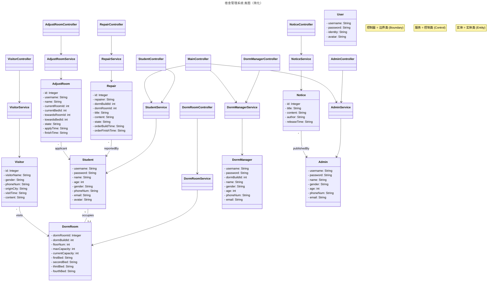

```mermaid
---
title: 宿舍管理系统 类图（简化）
---
classDiagram
    direction TB

    %% Controller (Boundary)
    class StudentController
    class DormRoomController
    class RepairController
    class AdjustRoomController
    class NoticeController
    class VisitorController
    class DormManagerController
    class AdminController
    class MainController

    %% Service (Control)
    class StudentService
    class DormRoomService
    class RepairService
    class AdjustRoomService
    class NoticeService
    class VisitorService
    class DormManagerService
    class AdminService

    %% Entity
    class Student {
        - username: String
        - password: String
        - name: String
        - age: int
        - gender: String
        - phoneNum: String
        - email: String
        - avatar: String
    }

    class DormRoom {
        - dormRoomId: Integer
        - dormBuildId: int
        - floorNum: int
        - maxCapacity: int
        - currentCapacity: int
        - firstBed: String
        - secondBed: String
        - thirdBed: String
        - fourthBed: String
    }

    class Repair {
        - id: Integer
        - repairer: String
        - dormBuildId: int
        - dormRoomId: int
        - title: String
        - content: String
        - state: String
        - orderBuildTime: String
        - orderFinishTime: String
    }

    class AdjustRoom {
        - id: Integer
        - username: String
        - name: String
        - currentRoomId: int
        - currentBedId: int
        - towardsRoomId: int
        - towardsBedId: int
        - state: String
        - applyTime: String
        - finishTime: String
    }

    class Notice {
        - id: Integer
        - title: String
        - content: String
        - author: String
        - releaseTime: String
    }

    class Visitor {
        - id: Integer
        - visitorName: String
        - gender: String
        - phoneNum: String
        - originCity: String
        - visitTime: String
        - content: String
    }

    class DormManager {
        - username: String
        - password: String
        - dormBuildId: int
        - name: String
        - gender: String
        - age: int
        - phoneNum: String
        - email: String
    }

    class Admin {
        - username: String
        - password: String
        - name: String
        - gender: String
        - age: int
        - phoneNum: String
        - email: String
    }

    class User {
        - username: String
        - password: String
        - identity: String
        - avatar: String
    }

    %% Controller 依赖 Service
    StudentController --> StudentService
    DormRoomController --> DormRoomService
    RepairController --> RepairService
    AdjustRoomController --> AdjustRoomService
    NoticeController --> NoticeService
    VisitorController --> VisitorService
    DormManagerController --> DormManagerService
    AdminController --> AdminService
    MainController --> StudentService
    MainController --> DormManagerService
    MainController --> AdminService

    %% Service 依赖 Entity
    StudentService --> Student
    DormRoomService --> DormRoom
    RepairService --> Repair
    AdjustRoomService --> AdjustRoom
    NoticeService --> Notice
    VisitorService --> Visitor
    DormManagerService --> DormManager
    AdminService --> Admin

    %% Entity 间关系
    Student "1" -- "0..4" DormRoom : occupies
    Repair "*" --> Student : reportedBy
    AdjustRoom "*" --> Student : applicant
    Visitor "*" --> DormRoom : visits
    Notice "*" --> Admin : publishedBy

    note "控制器 = 边界类 (Boundary)"
    note "服务 = 控制类 (Control)"
    note "实体 = 实体类 (Entity)"
```
