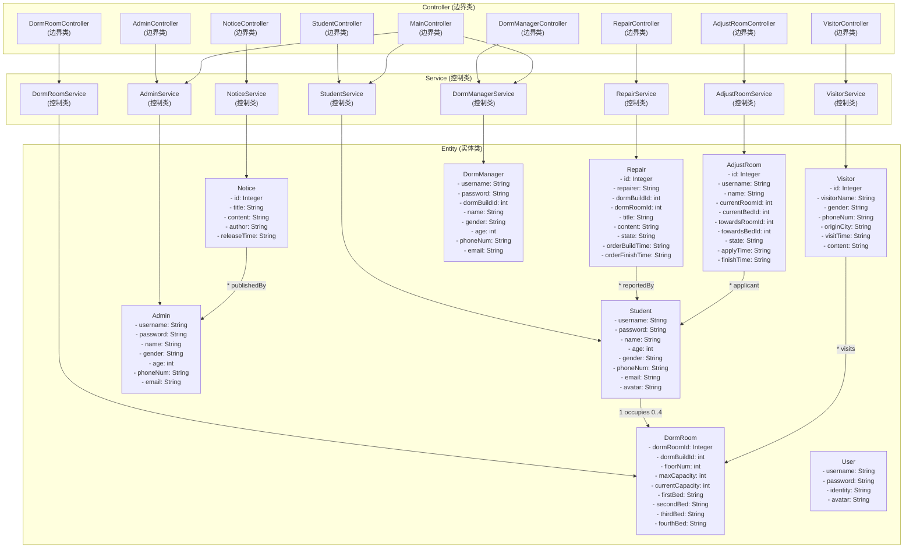

```mermaid
graph TD
    %% Controller (Boundary)
    StudentController["StudentController<br/>(边界类)"]
    DormRoomController["DormRoomController<br/>(边界类)"]
    RepairController["RepairController<br/>(边界类)"]
    AdjustRoomController["AdjustRoomController<br/>(边界类)"]
    NoticeController["NoticeController<br/>(边界类)"]
    VisitorController["VisitorController<br/>(边界类)"]
    DormManagerController["DormManagerController<br/>(边界类)"]
    AdminController["AdminController<br/>(边界类)"]
    MainController["MainController<br/>(边界类)"]

    %% Service (Control)
    StudentService["StudentService<br/>(控制类)"]
    DormRoomService["DormRoomService<br/>(控制类)"]
    RepairService["RepairService<br/>(控制类)"]
    AdjustRoomService["AdjustRoomService<br/>(控制类)"]
    NoticeService["NoticeService<br/>(控制类)"]
    VisitorService["VisitorService<br/>(控制类)"]
    DormManagerService["DormManagerService<br/>(控制类)"]
    AdminService["AdminService<br/>(控制类)"]

    %% Entity
    Student["Student<br/>- username: String<br/>- password: String<br/>- name: String<br/>- age: int<br/>- gender: String<br/>- phoneNum: String<br/>- email: String<br/>- avatar: String"]
    DormRoom["DormRoom<br/>- dormRoomId: Integer<br/>- dormBuildId: int<br/>- floorNum: int<br/>- maxCapacity: int<br/>- currentCapacity: int<br/>- firstBed: String<br/>- secondBed: String<br/>- thirdBed: String<br/>- fourthBed: String"]
    Repair["Repair<br/>- id: Integer<br/>- repairer: String<br/>- dormBuildId: int<br/>- dormRoomId: int<br/>- title: String<br/>- content: String<br/>- state: String<br/>- orderBuildTime: String<br/>- orderFinishTime: String"]
    AdjustRoom["AdjustRoom<br/>- id: Integer<br/>- username: String<br/>- name: String<br/>- currentRoomId: int<br/>- currentBedId: int<br/>- towardsRoomId: int<br/>- towardsBedId: int<br/>- state: String<br/>- applyTime: String<br/>- finishTime: String"]
    Notice["Notice<br/>- id: Integer<br/>- title: String<br/>- content: String<br/>- author: String<br/>- releaseTime: String"]
    Visitor["Visitor<br/>- id: Integer<br/>- visitorName: String<br/>- gender: String<br/>- phoneNum: String<br/>- originCity: String<br/>- visitTime: String<br/>- content: String"]
    DormManager["DormManager<br/>- username: String<br/>- password: String<br/>- dormBuildId: int<br/>- name: String<br/>- gender: String<br/>- age: int<br/>- phoneNum: String<br/>- email: String"]
    Admin["Admin<br/>- username: String<br/>- password: String<br/>- name: String<br/>- gender: String<br/>- age: int<br/>- phoneNum: String<br/>- email: String"]
    User["User<br/>- username: String<br/>- password: String<br/>- identity: String<br/>- avatar: String"]

    %% Controller 依赖 Service
    StudentController --> StudentService
    DormRoomController --> DormRoomService
    RepairController --> RepairService
    AdjustRoomController --> AdjustRoomService
    NoticeController --> NoticeService
    VisitorController --> VisitorService
    DormManagerController --> DormManagerService
    AdminController --> AdminService
    MainController --> StudentService
    MainController --> DormManagerService
    MainController --> AdminService

    %% Service 依赖 Entity
    StudentService --> Student
    DormRoomService --> DormRoom
    RepairService --> Repair
    AdjustRoomService --> AdjustRoom
    NoticeService --> Notice
    VisitorService --> Visitor
    DormManagerService --> DormManager
    AdminService --> Admin

    %% Entity 间关系
    Student -->|"1 occupies 0..4"| DormRoom
    Repair -->|"* reportedBy"| Student
    AdjustRoom -->|"* applicant"| Student
    Visitor -->|"* visits"| DormRoom
    Notice -->|"* publishedBy"| Admin

    %% 分组
    subgraph Controller["Controller (边界类)"]
        StudentController
        DormRoomController
        RepairController
        AdjustRoomController
        NoticeController
        VisitorController
        DormManagerController
        AdminController
        MainController
    end

    subgraph Service["Service (控制类)"]
        StudentService
        DormRoomService
        RepairService
        AdjustRoomService
        NoticeService
        VisitorService
        DormManagerService
        AdminService
    end

    subgraph Entity["Entity (实体类)"]
        Student
        DormRoom
        Repair
        AdjustRoom
        Notice
        Visitor
        DormManager
        Admin
        User
    end
```
